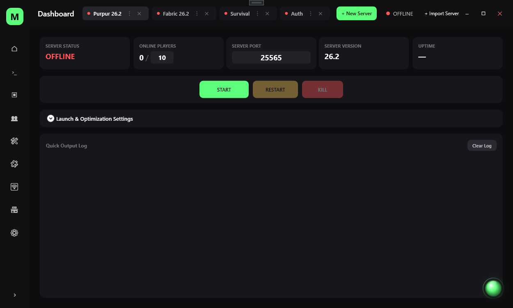
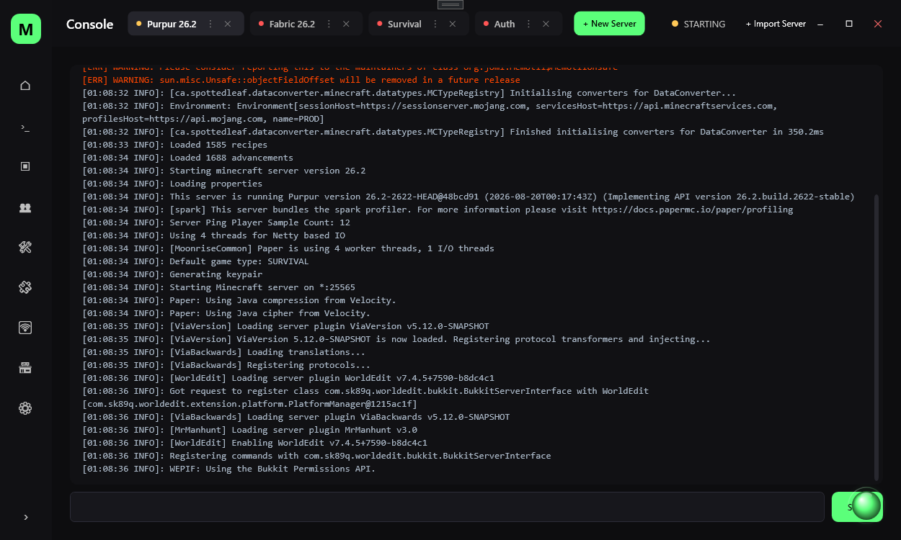
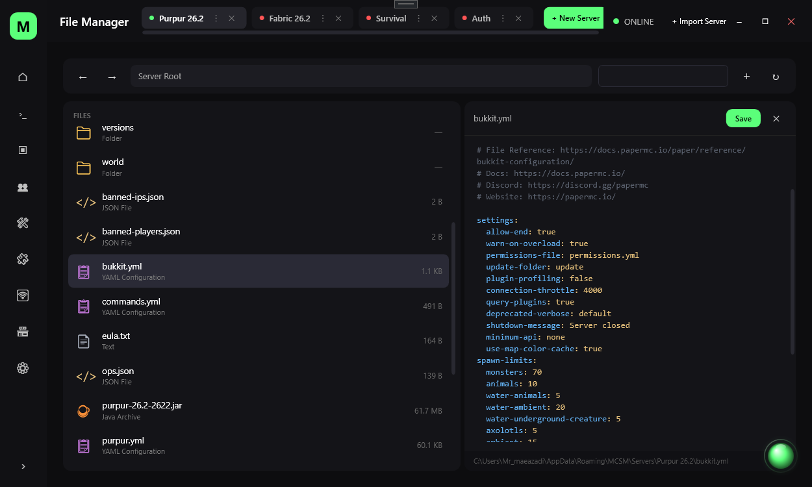
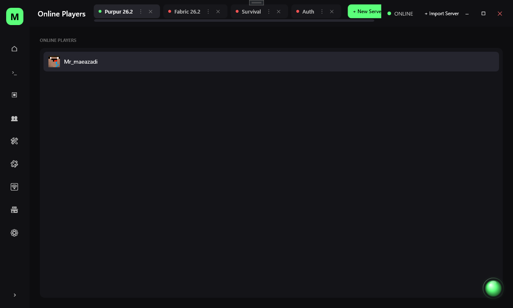
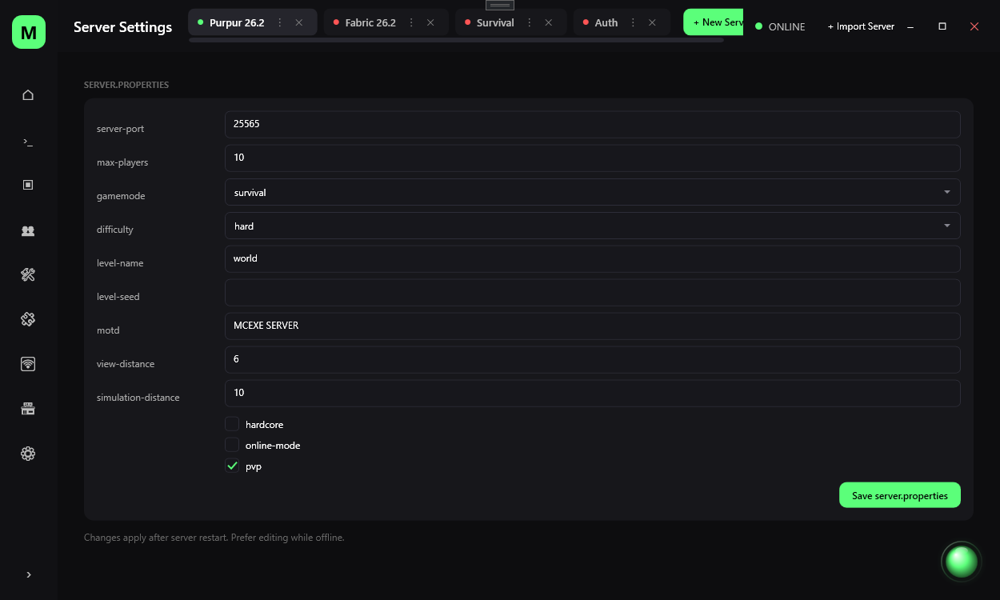
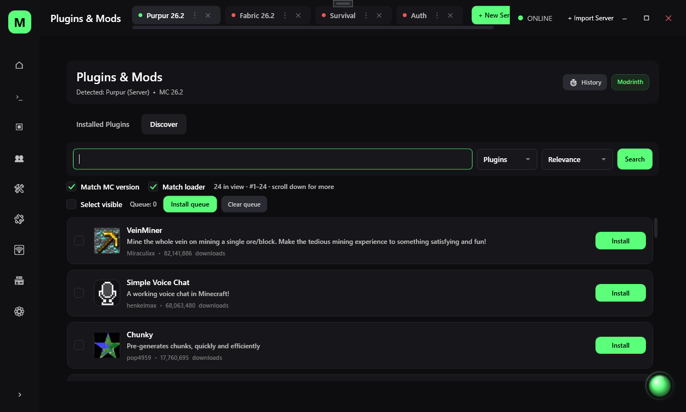
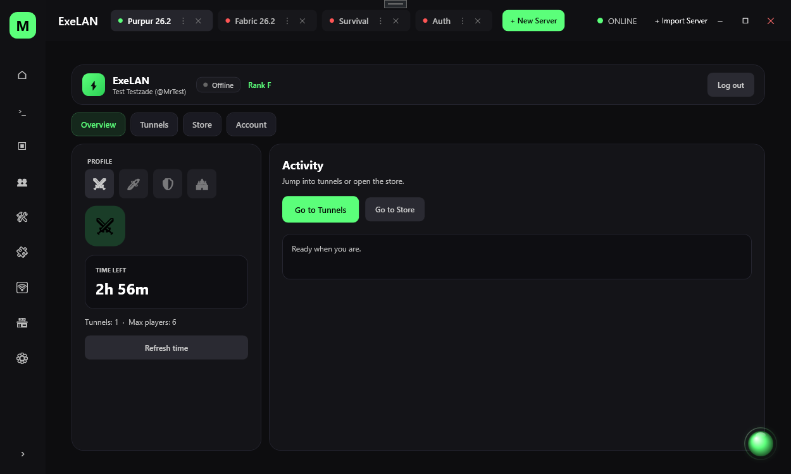

# Minecraft Server Manager

**One app to run, manage, and share your Minecraft servers — without the chaos.**

> **Run servers. Install plugins. Share your world. Stay in control.**  
> Built for players who host — not for people who enjoy fighting config files.

---

<!-- Replace with your real screenshots -->

  

  
  

  

  
  

  

---

## Why this exists

Managing a Minecraft server usually means:

- juggling folders, JARs, and `server.properties`
- hunting plugins across random sites
- asking friends to port-forward or use sketchy tunnels
- losing hours to “it just won’t start”

**Minecraft Server Manager** puts the whole workflow in one modern Windows app: create and control servers, install plugins/mods cleanly, watch the console, manage files, and share your world online when you want to.

**Question:** *Do I need to be a sysadmin?*  
**Answer:** No. If you can click Start and install a mod, you’re ready.

---

## Features

### Server control that feels like a real product
- Create and manage multiple servers from one place
- Start / stop / monitor with a clear dashboard
- Live console output you can actually read
- Player view and practical server tools
- File manager for your server directory
- Server settings without digging through every file by hand

### Plugins & Mods (Modrinth-powered)
- Browse and search plugins and mods inside the app
- Filters that match your loader and game version
- Install with dependency awareness
- Manage installed addons (enable, disable, delete, copy/cut)
- Discover UI designed to stay fast even with long lists

### ExeLAN — share your world without the usual pain
- Expose singleplayer or a local server through a public address style link
- Account system with ranks, time, and packages
- Built for real use: sessions, tunnels, and store flows
- Admin tools for people who run the service seriously

### Exira — a small companion in the UI
- On-screen helper that reacts to common server problems
- Tips, guidance, and a personality that doesn’t get in the way
- Voice features are being expanded carefully (offline-first direction)

### Quality-of-life
- Dark, clean UI consistent across the app
- Auto-update support so fixes reach you faster
- Designed to fail softly (connection issues shouldn’t nuke the whole experience)

---

## Screenshots

| Dashboard | Plugins & Mods | ExeLAN |
|-----------|----------------|--------|
|  |  |  |

| Console | Settings | Store / Account |
|---------|----------|-----------------|
|  |  |  |

> Tip: put real PNGs in `docs/images/` and keep these paths, or update the links.

---

## Quick start

### Requirements
- Windows 10 or 11
- A Minecraft server JAR (or one you create through the app flow)
- Internet for plugin discovery, updates, and ExeLAN (local server control works offline where possible)

### Install
1. Go to **[Releases](../../releases/latest)**
2. Download the latest installer (or portable zip, if you publish one)
3. Run the installer / extract and open the app
4. Create or select a server
5. Hit **Start** and you’re in

**Question:** *Is this a Minecraft client?*  
**Answer:** No. It’s a **server manager** and toolkit for hosts.

**Question:** *Does it replace Paper/Purpur/Fabric?*  
**Answer:** No. It helps you **run and manage** those stacks more comfortably.

---

## What you can do in 5 minutes

1. **Add a server** and point it at your folder or set one up  
2. **Start it** and watch the console live  
3. **Open Plugins & Mods**, search something you know (e.g. a popular plugin), install it  
4. **Restart** if needed and confirm it’s there  
5. Optional: open **ExeLAN**, sign in, and share a tunnel when you want friends on your world  

That’s the loop. Everything else is depth when you need it.

---

## ExeLAN in plain words

Want friends to join your world without teaching them port forwarding?

ExeLAN is the part of the ecosystem that helps turn your local game/server into something shareable, with accounts, packages, and tunnel control. It’s built as a serious service surface (auth, store, admin), not a throwaway demo.

> Some ExeLAN features need a working backend and account. The desktop manager still works for local server management without it.

---

## Safety & honesty

- Download **only** from this GitHub Releases page (or your official site)
- Windows SmartScreen may warn on new publishers — that’s normal for independent software until reputation builds
- We don’t need your Minecraft password
- Keep your server backups. Any powerful tool can delete files if you ask it to

**Question:** *Will antivirus hate it?*  
**Answer:** Unsigned or new apps sometimes get false positives. Prefer the official Release asset, keep updates on, and report false positives to your AV vendor if needed.

---

## Roadmap (high level)

- Stronger offline helper / voice experience for Exira  
- Smoother first-run and server templates  
- More polish on Plugins & Mods performance and discovery  
- Clearer ExeLAN onboarding and reliability under bad networks  

Ideas and bug reports are welcome in **Issues**.

---

## Contributing & feedback

Found a bug? Want a feature? Open an issue with:

- What you did  
- What you expected  
- What happened  
- App version + Windows version  

Good reports make good releases.

---

## Disclaimer

Minecraft is a trademark of Mojang / Microsoft. This project is **not** affiliated with Mojang or Microsoft.  
Server software (Paper, Purpur, Fabric, etc.) belongs to their respective owners.  
Use plugins/mods in line with their licenses and your local laws.

---

## Links

- **Latest download:** [Releases](../../releases/latest)  
- **Issues:** [Issues](../../issues)  
- **Website / updates (if applicable):** `https://mcexe.ir` (adjust to your real URL)

---

  <b>Stop fighting folders. Start hosting.</b> 
  Download the latest release and run your first server tonight.

---

# نسخه فارسی

## Minecraft Server Manager چیست؟

یک اپلیکیشن ویندوزی برای **ساخت، مدیریت و اشتراک‌گذاری سرور ماینکرفت** — بدون سردرگمی بین پوشه‌ها، JARها و تنظیمات پراکنده.

اگر تا امروز برای یک پلاگین ساده بین چند سایت می‌چرخیدی، یا برای دعوت دوست‌ها به پورت‌فوروارد و تونل‌های مبهم می‌رسیدی، این ابزار همان چیزی است که باید وسط میز کار باشد.

---

## چرا ساخته شد؟

مدیریت سرور معمولاً یعنی:

- چند پوشه و چند نسخه JAR  
- نصب پلاگین از منابع نامطمئن  
- errorهای گیج‌کننده داخل کنسول  
- دوست‌هایی که «وصل نمی‌شن»

**Minecraft Server Manager** این چرخه را جمع می‌کند: داشبورد، کنسول، بازیکنان، فایل‌ها، پلاگین/ماد، و در صورت نیاز اشتراک‌گذاری از طریق **ExeLAN**.

**سؤال:** آیا باید متخصص شبکه باشم؟  
**جواب:** نه. اگر Start را بلدی بزنی، راه می‌افتی.

---

## امکانات اصلی

### کنترل سرور
- چند سرور در یک جا  
- استارت/استاپ و وضعیت خوانا  
- کنسول زنده  
- مدیریت فایل و تنظیمات کاربردی  

### پلاگین و ماد (با کمک Modrinth)
- جستجو و نصب از داخل برنامه  
- فیلتر نسخه و لودر  
- توجه به dependency  
- مدیریت آیتم‌های نصب‌شده  

### ExeLAN
- مسیری برای اشتراک دنیا/سرور محلی با آدرس قابل ارسال  
- سیستم حساب، رنک، زمان و بسته‌ها  
- مناسب استفاده واقعی، نه فقط دمو  

### Exira
- دستیار داخل UI برای کمک در مشکلات رایج  
- در حال گسترش قابلیت‌های صوتی به‌صورت کنترل‌شده و ترجیحاً آفلاین  

---

## شروع سریع

1. از صفحه **Releases** آخرین نسخه را دانلود کن  
2. نصب کن یا از نسخه portable استفاده کن  
3. سرور بساز یا انتخاب کن  
4. Start بزن  
5. از بخش Plugins & Mods هر چه لازم داری نصب کن  

**سؤال:** آیا کلاینت ماینکرفت است؟  
**جواب:** خیر. ابزار **مدیریت سرور** است.

---

## امنیت و اعتماد

- فقط از GitHub Releases (یا سایت رسمی خودت) دانلود کن  
- هشدار SmartScreen برای نرم‌افزارهای تازه‌ناشر طبیعی است  
- پسورد اکانت ماینکرفت لازم نیست  
- همیشه از دنیا و سرور بکاپ داشته باش  

---

## مشارکت

باگ دیدی یا ایده داری؟ Issue باز کن و بنویس:

- چی کار کردی  
- چی انتظار داشتی  
- چی شد  
- نسخه برنامه و ویندوز  

---

## سلب مسئولیت

ماینکرفت متعلق به Mojang/Microsoft است. این پروژه وابسته به آن‌ها نیست.  
نرم‌افزارهای سرور و پلاگین‌ها متعلق به سازندگان خودشان هستند.

---

  <b>کمتر درگیر پوشه شو. بیشتر میزبانی کن.</b> 
  آخرین Release را بگیر و امشب اولین سرورت را بالا بیاور.

